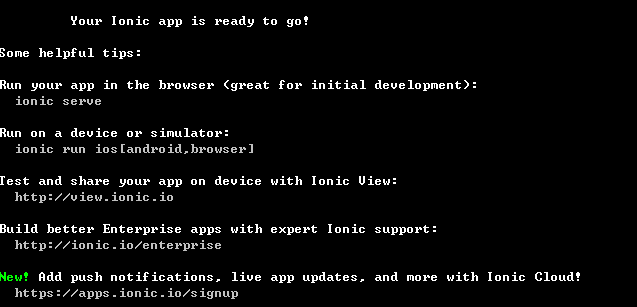

# ionic框架

## 开发环境搭建 Android 平台
1. 安装 [java jdk](http://www.oracle.com/technetwork/java/javase/downloads/jdk8-downloads-2133151.html)

    配置 java 环境变量
    
    JAVA_HOME： C:\Program Files\Java\jdk1.8.0_111

    path: %JAVA_HOME%\bin;

2. 下载 android SDK 国内不能登录谷歌官网，但我们可以通过**百度软件中心***[下载](http://rj.baidu.com/soft/detail/23485.html?ald)

    配置 Android 环境变量

    ANDROID_HOME： D:\sdk

    path: %ANDROID_HOME%\tools;%ANDROID_HOME%\platform-tools;

    

3. Node 安装 

    [node下载](https://nodejs.org/en/)

    *新版本node在安装时会自动配置环境变量*

    node 安装时会带有 [NPM](https://www.npmjs.com/) 包管理工具 

    **注意**
    国内用户在使用 npm 安装所需要的模块时会很慢。可以配置 npm 的镜像源为淘宝镜像。

    ``` shell
    npm config set registry http://registry.npm.taobao.org
    ```
4. 安装项目依赖环境
    ``` shell
    npm  install   -g    cordova
    npm  install   -g    ionic
    ```

## 项目搭建

1. 创建项目模板
    ``` shell
    //ionic 会从 github 下载项目模板。
    ionic start app
    ```
    
    
    **下载模板的过程有点长,一直等到下面界面。**

    

2. 添加平台
    ``` shell
    ionic platform add android
    ```
    

    **下载 android 工程到项目中**

    

3. 将工程打包成 apk 
    ``` shell
    ionic build android
    ```
    **第一次打包时时间会很久需要耐心等待**

    


